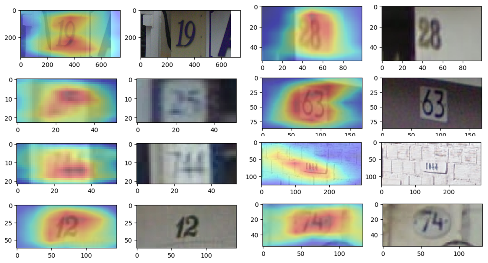

# Weakly Supervised Text Detector

I am implementing a detection algorithm with a classification data set that does not have annotation information for the bounding box. I used the class activation mapping proposed in [Learning Deep Features for Discriminative Localization](https://arxiv.org/pdf/1512.04150.pdf).

## Usage

The procedure to build detector is as follows:

### 1. Extract Resnet50 Features ([1_extract_features.py](https://github.com/penny4860/Weakly-Supervised-Text-Detection/blob/master/1_extract_features.py))

This is the process of extracting the final feature vector from pretrained resnet50. The experimental results for the class activation map for resnet50 are not shown in [Learning Deep Features for Discriminative Localization](https://arxiv.org/pdf/1512.04150.pdf). However, resnet50 bypasses the use of FC Layer by using global average pooling. So I used final feature vector in resnet50.

I used an image with text as a positive sample and a natural scene image without text as a negative sample.

### 2. Train Linear Support Vector Machine ([2_train_svm.py](https://github.com/penny4860/Weakly-Supervised-Text-Detection/blob/master/2_train_svm.py))

### 3. Get Class Activation Map ([3_activate_cam.py](https://github.com/penny4860/Weakly-Supervised-Text-Detection/blob/master/3_activate_cam.py))

## Results

### 1. [The Street View House Numbers Dataset](http://ufldl.stanford.edu/housenumbers/)

The figure below shows the result of SVHN digit detection using the resnet50's features and class activation mapping.

### 2. [Kaist Scene Text Database](http://www.iapr-tc11.org/mediawiki/index.php/KAIST_Scene_Text_Database)

## References

* [Learning Deep Features for Discriminative Localization](https://arxiv.org/pdf/1512.04150.pdf)

