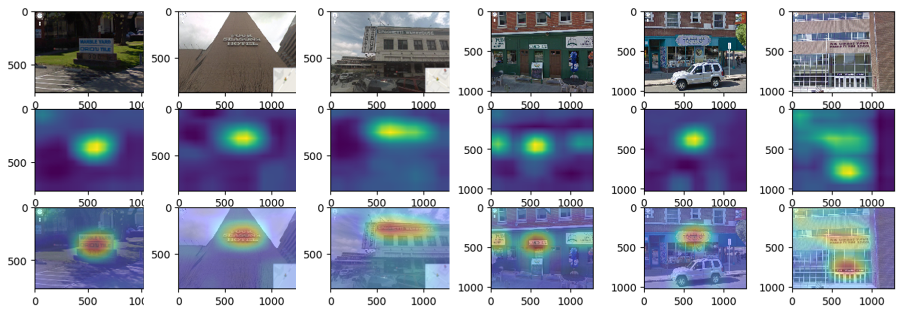

# Weakly Supervised Text Detector

I am implementing a detection algorithm with a classification data set that does not have annotation information for the bounding box. I used the class activation mapping proposed in [Learning Deep Features for Discriminative Localization](https://arxiv.org/pdf/1512.04150.pdf).

## Requirements

The description will be added...

## Usage

The procedure to build detector is as follows:

### 1. Fine Tuning  ([1_train.py](https://github.com/penny4860/Weakly-Supervised-Text-Detection/blob/master/1_train.py))

The description will be added...

### 2. Plot Class Actication Map ([2_cam_plot.py](https://github.com/penny4860/Weakly-Supervised-Text-Detection/blob/master/2_cam_plot.py))

The description will be added...

## Results

## References

* [Learning Deep Features for Discriminative Localization](https://arxiv.org/pdf/1512.04150.pdf)

